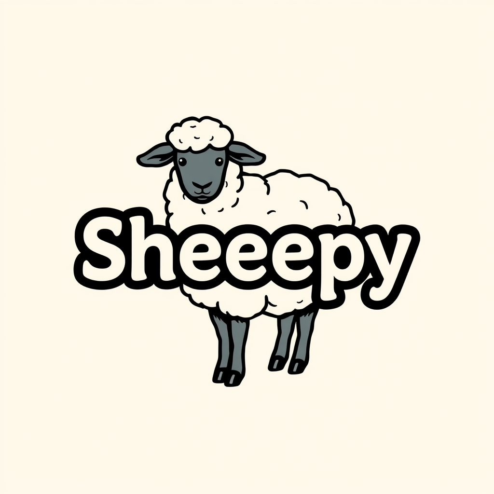

# sheepy 🐑 


[](https://pypi.org/project/sheepy/)
[](https://pypi.org/project/sheepy/)


Sheepy is a lightweight unit testing framework designed for Python developers who value simplicity and ease of use. It provides a core set of components to write unit tests and generate basic test reports.



### Features

* **Test decoration**: Using the @sheepy decorator to mark functions as test cases.
* **Test discovery**: Automatically finding test cases within a specified class.
* **Test runner**: Executing test cases and collecting results.
* **Basic reporting**: Generating a simple pass/fail report.
* **Logging**: Providing a mechanism for logging test execution details.

### Installation

``` bash
pip install sheepy
```

### Usage

Here's a basic example of how to use Sheepy:

``` Python
from sheepy import sheepy

   @sheepy
   def test_add():
       assert 2 + 2 == 4

```

### Customization

Sheepy allows for customization in several ways:

* **Logging:** ...
* **Reporting:** ...
* **Test discovery:** ...
